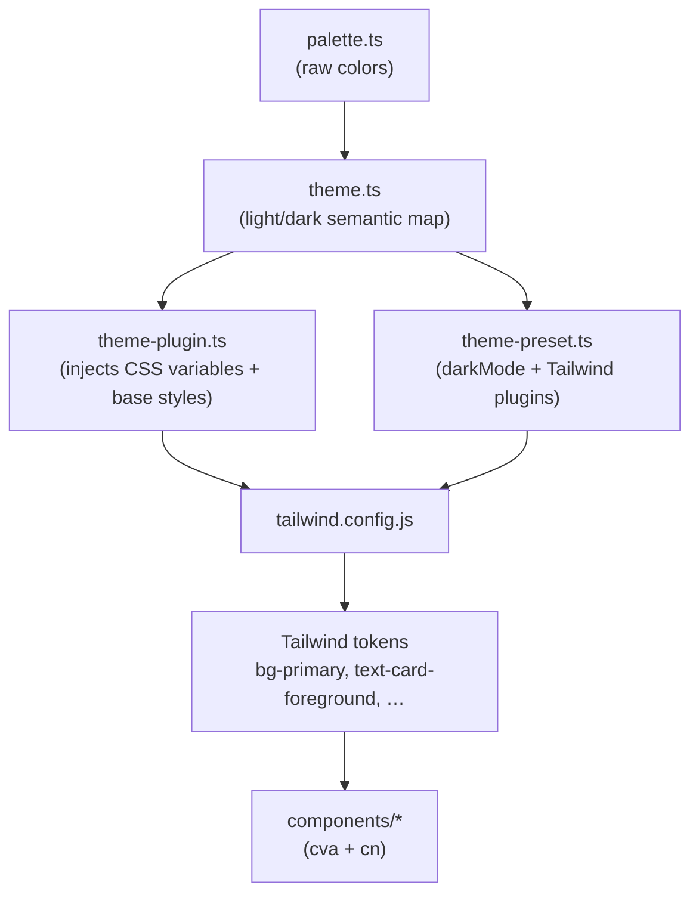
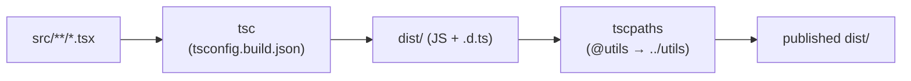

# Contributing

Thanks for helping improve `@alexandermann/ui-toolkit`. This guide covers how
the project is put together and the checks a change must pass.

> Human contributors and AI agents alike should also read [CLAUDE.md](CLAUDE.md),
> which documents the day-to-day conventions in more detail.

## Prerequisites

- **Node.js** 20+
- **pnpm** (the only supported package manager — see the `packageManager` field
  in `package.json`). Do not use npm or yarn for installs.

```bash
pnpm install
```

## Local development

| Task                 | Command                                            |
| -------------------- | -------------------------------------------------- |
| Run Storybook        | `pnpm storybook` (http://localhost:6006)           |
| Typecheck ("test")   | `pnpm test`                                        |
| Lint                 | `pnpm lint` (autofix `pnpm lint:fix`)              |
| Format               | `pnpm prettier`                                    |
| Build the library    | `pnpm build`                                       |
| Scaffold a component | `pnpm generate:component`                          |
| Color-contrast gate  | `pnpm contrast`                                    |
| Visual regression    | `pnpm vrt` (compare) / `pnpm vrt:update` (refresh) |

There is no unit-test framework — a passing `tsc` typecheck (`pnpm test`) is the
test. Before opening a PR, make sure `pnpm test`, `pnpm lint`, and (for any
color/theme change) `pnpm contrast` all pass.

## Architecture

The theme is data that flows into Tailwind; components only ever reference the
resulting semantic tokens, never raw colors.



Dark mode is driven by a `data-mode="dark"` attribute on an ancestor element;
`theme-plugin.ts` defines the CSS variables for both modes and `theme-preset.ts`
registers the `darkMode` selector.

### Build pipeline

There is no runtime bundler. TypeScript compiles `src/` and `tscpaths` rewrites
the `@*` path aliases to relative paths in the output. Storybook stories and
specs are excluded from the published build via `tsconfig.build.json`, so only
component/utility/style code lands in `dist/` (the `files` field limits the
published tarball to `dist/`).



## Adding a component

1. `pnpm generate:component` scaffolds the four files
   (`<name>.tsx`, `index.ts`, `<name>.stories.tsx`, `<name>.mdx`) and appends the
   barrel export.
2. Flesh out `<name>.tsx` following the `class-variance-authority` pattern in
   [`src/components/button/button.tsx`](src/components/button/button.tsx).
3. Use only theme tokens for color (`bg-primary`, `text-destructive-foreground`,
   …) — never hardcode hex values.
4. If you introduce a new foreground/background pairing, add it to the `checks`
   array in `scripts/check-contrast.mjs` and run `pnpm contrast`.

## Visual regression baselines

Baselines are generated **only in CI** (rendering is environment-sensitive). Do
not commit locally-generated snapshots. After an intentional visual change, run
the **Visual Regression** workflow manually with `update_baselines = true` to
regenerate and commit them.

## Publishing

Version bumps and `npm publish` happen via `pnpm npm-publish`. Do **not** publish
or bump the version unless explicitly asked.
