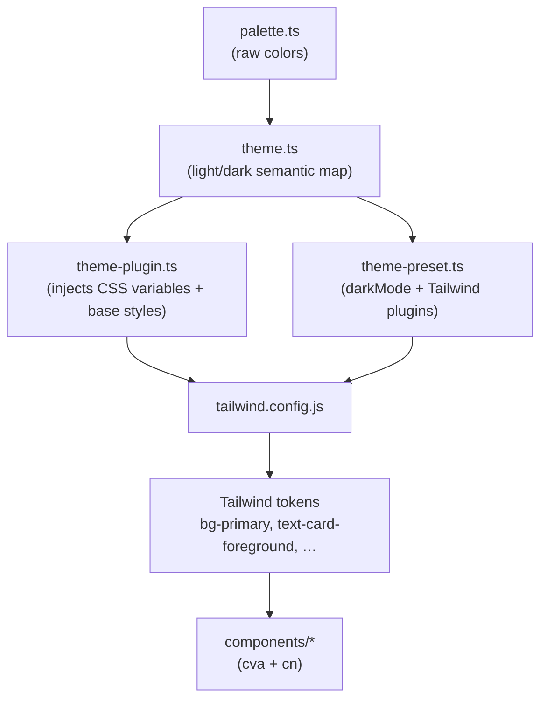
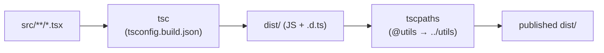

# Contributing

Thanks for helping improve `@alexandermann/ui-toolkit`. This guide covers how
the project is put together and the checks a change must pass.

> Human contributors and AI agents alike should also read [CLAUDE.md](CLAUDE.md),
> which documents the day-to-day conventions in more detail.

## Prerequisites

- **Node.js** 20+
- **pnpm** (the only supported package manager — see the `packageManager` field
  in `package.json`). Do not use npm or yarn for installs.

```bash
pnpm install
```

## Local development

| Task                 | Command                                            |
| -------------------- | -------------------------------------------------- |
| Run Storybook        | `pnpm storybook` (http://localhost:6006)           |
| Typecheck ("test")   | `pnpm test`                                        |
| Lint                 | `pnpm lint` (autofix `pnpm lint:fix`)              |
| Format               | `pnpm prettier`                                    |
| Build the library    | `pnpm build`                                       |
| Scaffold a component | `pnpm generate:component`                          |
| Color-contrast gate  | `pnpm contrast`                                    |
| Tailwind preset gate | `pnpm preset`                                      |
| Visual regression    | `pnpm vrt` (compare) / `pnpm vrt:update` (refresh) |

There is no unit-test framework — a passing `tsc` typecheck (`pnpm test`) is the
test. Before opening a PR, make sure `pnpm test`, `pnpm lint`, (for any
color/theme change) `pnpm contrast`, and (for any change to `theme-preset.ts`,
the `src/styles` barrel, or `tailwind.config.js`) `pnpm preset` all pass.

## Architecture

The theme is data that flows into Tailwind; components only ever reference the
resulting semantic tokens, never raw colors.



Dark mode is driven by a `data-mode="dark"` attribute on the element or an
ancestor; `theme-plugin.ts` defines the CSS variables for both modes and
`theme-preset.ts` registers the `darkMode` selector. `themePreset` must stay a
named export; the `no-restricted-syntax` rule in `eslint.config.mjs` bans
`export * as`, which `pnpm preset` cannot detect. See the notes in
`theme-preset.ts`.

### Build pipeline

There is no runtime bundler. TypeScript compiles `src/` and `tscpaths` rewrites
the `@*` path aliases to relative paths in the output. Storybook stories and
specs are excluded from the published build via `tsconfig.build.json`, so only
component/utility/style code lands in `dist/` (the `files` field limits the
published tarball to `dist/`).



## Adding a component

1. `pnpm generate:component` scaffolds the four files
   (`<name>.tsx`, `index.ts`, `<name>.stories.tsx`, `<name>.mdx`) and appends the
   barrel export. Larger components may add `<name>.constants.ts`,
   `<name>.variants.ts`, and `<name>.utils.ts` siblings by hand — see
   "Splitting up a large component" in CLAUDE.md
   ([`src/components/popover/`](src/components/popover/) is the reference).
2. Flesh out `<name>.tsx` following the `class-variance-authority` pattern in
   [`src/components/button/button.tsx`](src/components/button/button.tsx).
3. Use only theme tokens for color (`bg-primary`, `text-destructive-foreground`,
   …) — never hardcode hex values.
4. If you introduce a new foreground/background pairing, add it to the `checks`
   array in `scripts/check-contrast.mjs` and run `pnpm contrast`.
5. If you add or rename a theme token, update the docs that enumerate them —
   see "Theming" in [CLAUDE.md](CLAUDE.md) for the full list of surfaces.

## Visual regression baselines

Baselines are generated **only in CI** (rendering is environment-sensitive). Do
not commit locally-generated snapshots. After an intentional visual change, run
the **Visual Regression** workflow manually with `update_baselines = true` to
regenerate and commit them.

If a diff fails, fix the component or refresh the baseline — don't widen the
tolerance in `playwright.config.ts`. `maxDiffPixels` is a structural budget, and
a light-on-light component costs surprisingly few pixels to appear or vanish
(~1,500 on a 1280x720 frame), so a budget in the thousands hides real
regressions. `tests/vrt/tolerance.spec.ts` fails if it grows that loose.

## Dependency overrides

`package.json` has a `pnpm.overrides` block that force-upgrades a handful of
**transitive, dev-only** packages (pulled in by Storybook, plop, webpack, and
tscpaths) to versions that clear known advisories. None of these are part of the
published runtime — the shipped `dependencies` are `class-variance-authority`,
`clsx`, `tailwind-merge`, `lucide-react`, `@tailwindcss/container-queries`, and
`tailwindcss-animate`.

Overrides are intentionally limited to **same-major** upgrades. Advisories whose
only fix is a major bump of a package that a build tool pins to an older major
(e.g. `picomatch` under `micromatch`, `ajv` under ESLint) are **not** overridden
— forcing them breaks the toolchain. Those are left to Dependabot, which opens
PRs as the upstream tools ship compatible releases. Remove an override once the
direct dependency includes the fix on its own.

## Publishing

Version bumps and `npm publish` happen via `pnpm npm-publish`. Do **not** publish
or bump the version unless explicitly asked.
